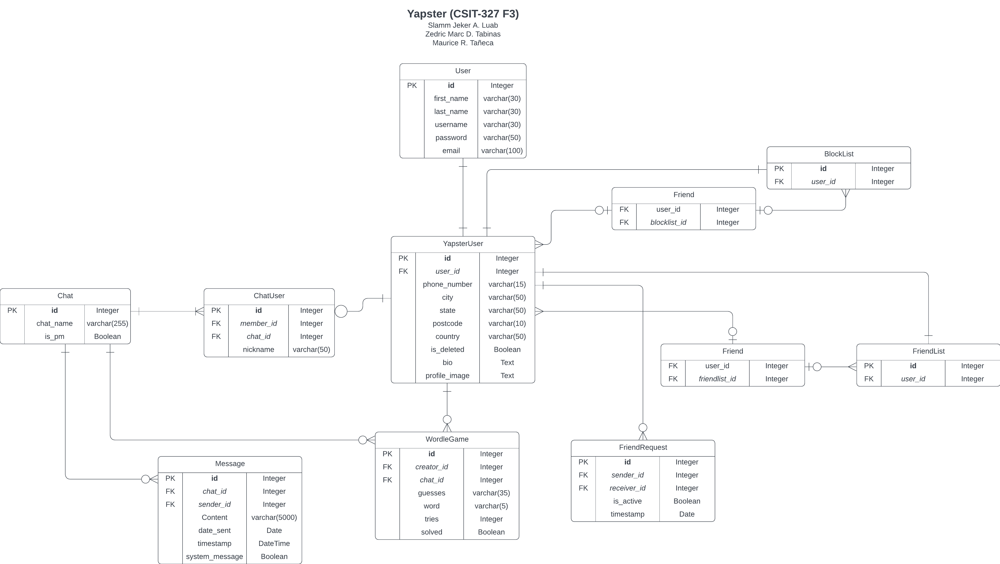

  <h3>✉️ Yapster</h3>
  

    An online messaging web app.
  

## 💼 Functional Requirements
<ol>
  <li>User Registration</li>
  - Users are allowed to create an account to be used as an entry point to all the communication services.
  <li>Profile Management</li>
  - Users shall be allowed to update, delete their profile, this includes setting a profile picture, status, and personal information.
  <li>Search Functionality</li>
  - The website shall implement a search function to allow users to search for contacts.
  <li>Real-time Communication</li>
  - Users should be able to send and receive text messages in real-time with other people.
  <li>Contact Management</li>
  - Users shall be allowed to add, remove, and manage contacts.
  <li>Minigames</li>
  - Users will be able to create a minigame called wordle and share it to contacts for them to answer it.
</ol>

## [🗓️ Gantt Chart](documentation/Gantt_Chart.pdf)

## [🌐 Entity Relationship Diagram](documentation/ERD_File.pdf)

## [🎨 UI/UX Design](documentation/UIUX.pdf)

## 🛠️ Built With
* [![Django][Django]][Django-url]

## 🙅🏼 Contributors

<ul>
    <li>Slamm Khelmer A. Luab</li>
    <li>Zedric Marc D. Tabinas</li>
    <li>Maurice R. Tañeca</li>
</ul>

(<a href="#readme-top">back to top</a>)

[contributors-shield]: https://img.shields.io/github/contributors/pokemau/yapster.svg?style=for-the-badge
[contributors-url]: https://github.com/pokemau/yapster/graphs/contributors

[Django]: https://img.shields.io/badge/Django-092E20?style=for-the-badge&logo=django&logoColor=green
[Django-url]: https://www.djangoproject.com/